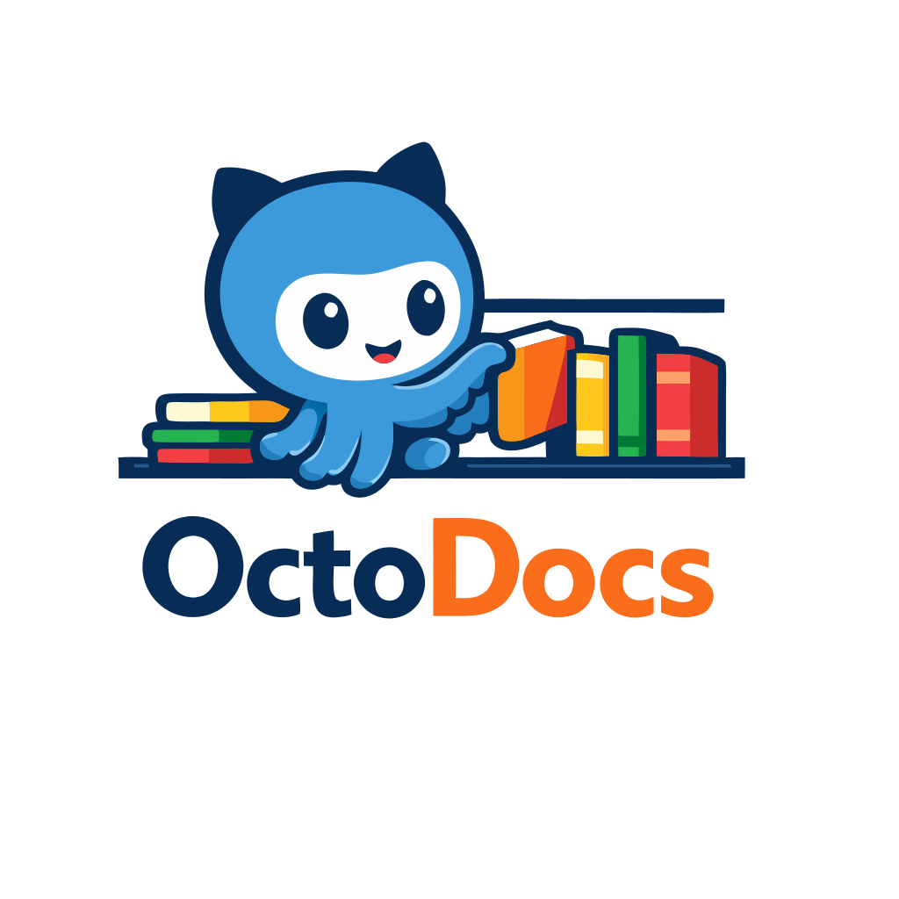

<div align="center">

</div>

**A self-managed documentation editor backed by GitHub.**

I always wanted a tool where I could write, organize, and navigate my documentation — and have it automatically backed up to a GitHub repository, with zero configuration beyond "log in and pick a repo." No terminal. No git commands. No merge conflicts. Just open the app, write, and everything syncs.

OctoDocs is that tool. It's a native desktop Markdown editor built for **everyone** — whether you're a developer who lives in the terminal or someone who has never heard of git. The experience is the same: a clean WYSIWYG editor where you write formatted text, and your files are safely stored in a GitHub repo behind the scenes.

---

## What It Does

- **WYSIWYG Markdown editing** — You write in a single continuous editor surface (Word/Docs-style). Headings, bold, italic, code, underline, and strikethrough are rendered in real time with no raw syntax visible while editing.
- **GitHub sync on every save** — Press Ctrl+S and your document is pushed to GitHub automatically. No staging, committing, or pushing. Just save.
- **File explorer sidebar** — Browse and manage all your Markdown files in a tree view. Create files and folders. Rename them. Everything syncs.
- **Mermaid diagrams** — Write Mermaid diagram code blocks and see them rendered as full-color images inline, no external tools required.
- **Multi-repo support** — Connect multiple GitHub repositories. Each local folder maps to a repo/branch/folder.
- **First-run onboarding** — On first launch, the app walks you through GitHub login and repo selection. No example files, no configuration screens. You're writing in 60 seconds.

## Who Is This For

- **Non-technical users** who want a simple, Notion-like editor that backs up to GitHub without knowing what GitHub is. Just log in once, pick where to store your docs, and write.
- **Developers and technical writers** who want their documentation in a GitHub repo but don't want to context-switch to a terminal or deal with git workflows for simple note-taking.
- **Teams** who want a shared documentation repository where anyone — regardless of technical skill — can contribute through a native desktop app.

## How It Works

1. **Open OctoDocs** — The app launches and walks you through connecting your GitHub account (OAuth device flow — no passwords, no SSH keys, just a code you enter on github.com).
2. **Pick a repo and folder** — Choose where your documents live. OctoDocs imports any existing `.md` files from that folder.
3. **Write** — The continuous WYSIWYG editor hides Markdown syntax. Use the toolbar (bold, italic, underline, strikethrough, code, headings) or keyboard shortcuts.
4. **Save** — Ctrl+S saves locally and pushes to GitHub in the background. A status badge shows sync progress.
5. **Browse** — The sidebar shows your file tree. Click to open files, create new ones, organize folders. Rename a file and it renames on GitHub too.

---

## Getting Started

### Requirements

- **Linux** (primary target), macOS, or Windows
- **Rust nightly** toolchain (managed automatically via `rust-toolchain.toml`)
- **Linux system dependencies** for GPU-accelerated rendering:
  ```bash
  sudo apt install libxcb1-dev libxkbcommon-dev libwayland-dev libvulkan-dev vulkan-validationlayers libsecret-1-dev
  ```

### Build & Run

```bash
# Install Rust if you don't have it
curl --proto '=https' --tlsv1.2 -sSf https://sh.rustup.rs | sh

# Clone the repo
git clone https://github.com/elranu/octodocs.git
cd octodocs/desktop

# Build and run (nightly toolchain is auto-selected)
cargo run -p octodocs-app
```

### Useful Commands

```bash
cargo build -p octodocs-app          # Build the app
cargo run -p octodocs-app            # Run the app
cargo test -p octodocs-core          # Run core library tests
cargo clippy --workspace             # Lint
make reset-state                     # Clear all local state (tokens, bindings) for a fresh start
```

---

## Architecture

OctoDocs is a Cargo workspace with three crates:

| Crate | Purpose |
|---|---|
| **octodocs-core** | Pure Rust library — document model, Markdown parsing, Mermaid rendering. No UI dependency. |
| **octodocs-app** | Desktop application built with [GPUI](https://www.gpui.rs/) (GPU-accelerated UI framework). Views, toolbar, sidebar, state management. |
| **octodocs-github** | GitHub integration — OAuth device flow, token storage, Contents API for push/pull/delete. No UI dependency. |

The UI is built on **GPUI** (the framework behind [Zed](https://zed.dev/)) with **adabraka-ui** as the component library. Both are vendored as patches under `desktop/patches/` for stability and custom fixes.

### Key Design Decisions

- **No local git** — Files sync via the GitHub REST API (Contents API). One HTTP PUT per save. No `.git` directory, no `git` binary, no merge conflicts.
- **No Node.js** — Mermaid diagrams are rendered with a pure Rust renderer (`mermaid-rs-renderer` + `resvg`), rasterized to PNG at 2× resolution.
- **Single continuous document editor** — One `DocumentEditorState` owns the whole document; cursor and selection flow across the full surface (no block activation mode switching).
- **Rich inline formatting model** — Inline spans are edited as typed runs and serialized back to Markdown with normalization to avoid delimiter noise.

---

## Project Structure

```
octodocs/
├── desktop/                      # Cargo workspace root
│   ├── crates/
│   │   ├── octodocs-core/        # Document model, renderer, Mermaid
│   │   ├── octodocs-app/         # GPUI desktop application
│   │   │   ├── src/
│   │   │   │   ├── main.rs
│   │   │   │   ├── app_state.rs  # Central application state
│   │   │   │   └── views/        # Root layout, document editor, sidebar, modals
│   │   │   └── assets/icons/     # Lucide SVG icons
│   │   └── octodocs-github/      # GitHub API integration
│   └── patches/
│       ├── adabraka-gpui/        # Vendored GPUI fork (GPU fixes)
│       └── adabraka-ui/          # Vendored component library (editor patches)
├── docs/plans/                   # Implementation plans (architecture docs)
└── README.md
```

---

## Current Status

OctoDocs is in active development. Here's what's working:

- [x] WYSIWYG continuous editor (Word/Docs-style)
- [x] Markdown rendering (headings, bold, italic, code, lists, blockquotes, tables, horizontal rules)
- [x] Mermaid diagram rendering (flowcharts, sequence diagrams, etc.)
- [x] GitHub OAuth device flow authentication
- [x] Auto-push to GitHub on every save
- [x] File explorer sidebar with create file/folder
- [x] File rename with GitHub sync
- [x] Multi-repo bindings with folder-level granularity
- [x] First-run onboarding with initial file import
- [x] Subfolder-aware sync (preserves directory structure)
- [x] Light/dark theme (follows system preference)
- [x] Contextual sync status badge

### Planned

- [ ] Rich text parity improvements (nested inline styles, better keyboard shortcut coverage)
- [ ] Cross-block selection and undo/redo
- [ ] Pull changes from GitHub (currently push-only)
- [ ] Conflict resolution UI
- [ ] Export to PDF/HTML
- [ ] macOS and Windows builds

### Implementation Notes

- Formatting implementation details and debugging technique are documented in [docs/word-style-formatting-technique.md](docs/word-style-formatting-technique.md).

---

## License

This project is licensed under the MIT License. See [LICENSE](LICENSE) for details.
