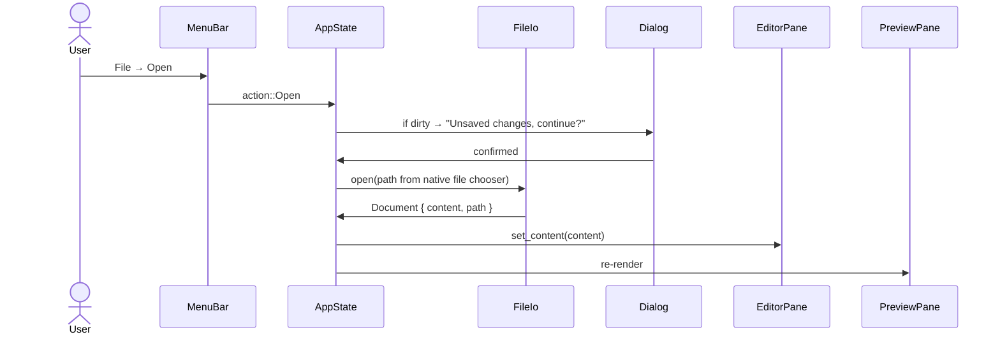

# Desktop Markdown Editor — Implementation Plan

## Overview

Build a simple, polished desktop Markdown editor as the first deliverable of the **OctoDocs** monorepo. The editor must support opening, creating, editing, saving, and "Save As" of `.md` files, with real-time Markdown preview and first-class Mermaid diagram rendering. It is built in Rust using **GPUI** (GPU-accelerated UI framework from Zed) with **adabraka-ui** as the component library.

## Current Implementation Status (2026-02-25)

- ✅ Editor + live preview working in split-pane layout
- ✅ New/Open/Save/Save As working from toolbar actions
- ✅ Toolbar formatting actions working (bold, italic, h1, h2, inline code)
- ✅ Theme initialization follows system window appearance (light/dark)
- ✅ Toolbar icon visibility fixed (icons loaded from crate-local assets path)
- ✅ Clean `cargo build -p octodocs-app` with zero warnings
- ⚠️ Mermaid currently renders as formatted source block (not SVG yet)
- ⚠️ Unsaved-changes confirmation dialog not implemented yet
- ⚠️ MenuBar-based File menu was removed due upstream adabraka-ui menu rendering limitations in current vendored version

References:
- External: [GPUI framework](https://www.gpui.rs/) · [GPUI crate source](https://github.com/zed-industries/zed/tree/main/crates/gpui)
- External: [adabraka-ui component library](https://github.com/Augani/adabraka-ui) · [adabraka-ui docs](https://augani.github.io/adabraka-ui/)
- External: [zlyph — reference minimal GPUI editor](https://github.com/douglance/zlyph)
- External: [awesome-gpui — ecosystem reference](https://github.com/zed-industries/awesome-gpui)
- External: [create-gpui-app scaffold tool](https://github.com/zed-industries/create-gpui-app)

---

## Design Alignment

### Chosen Direction

**Approach:** Split-pane live preview editor (source left / rendered preview right)

**Rationale:** True single-pane WYSIWYG (Typora-style) is architecturally complex for v1 — it requires mapping cursor positions between raw source and styled DOM. A split-pane model delivers the same "see the result as you type" experience with significantly less complexity, is well understood by Markdown authors, and is the pattern used by VS Code, HackMD, and Obsidian's source mode. It can evolve toward single-pane in a future phase.

### Scope

**In scope:**
- New file creation
- Open existing `.md` file (file dialog)
- Edit raw Markdown in a text editor pane with syntax highlighting
- Live-updating rendered preview pane
- Save (`Ctrl+S`)
- Save As (`Ctrl+Shift+S`)
- Toolbar for common MD formatting (bold, italic, heading 1-3, code block, link, image)
- Mermaid diagram blocks rendered as SVG in the preview
- Light/dark theme toggle
- Status bar (filename, cursor position, word count)
- Unsaved-changes guard (dialog before close/open)

**Out of scope (deferred):**
- Git integration (planned for next phase)
- File tree / sidebar file browser
- Tabs for multiple open files
- Export to PDF/HTML
- Custom themes or fonts configuration
- Collaboration / multi-cursor
- Extension / plugin system

### Constraints
- Rust nightly toolchain required (adabraka-ui dependency)
- Target platforms: Linux (primary), macOS, Windows (GPUI is cross-platform)
- User has **no Rust installed** — plan must document Rust setup steps clearly in Requirements
- No Node.js dependency for Mermaid rendering (native Rust renderer preferred)
- Monorepo: editor lives under `desktop/` in the `octodocs` repo

### Risks & Concerns

| Risk / Concern | Source | Resolution |
|---|---|---|
| GPUI API churn — tied to Zed's internal evolution | Investigation | Pin to crates.io release; adabraka-ui publishes stable crates |
| adabraka-ui requires nightly Rust | Investigation | Documented in Requirements; use `rust-toolchain.toml` to pin |
| No mature native Mermaid Rust renderer for all diagram types | Investigation | Use `mermaid-rs-renderer` for v1; fallback to raw code block display if parse fails |
| GPUI has limited official docs — most reference is Zed source | Investigation | Use adabraka-ui examples, zlyph, and gpui-book as learning resources |
| `pulldown-cmark` does not understand ```` ```mermaid ```` fence specially | Investigation | Pre-process code blocks before rendering; detect language tag |

### Questions Resolved During Process
- *What UI pattern for "WYSIWYG"?* → Split-pane live preview; delivers near-WYSIWYG UX without cursor-mapping complexity
- *Native or subprocess Mermaid rendering?* → Native Rust renderer (`mermaid-rs-renderer` or `selkie`); avoids Node.js dependency
- *Single crate or workspace?* → Workspace with separate `core` and `app` crates to isolate logic from UI (mirrors zlyph's pattern)
- *adabraka-ui vs raw GPUI?* → Use adabraka-ui; it ships MenuBar, Toolbar, Editor, StatusBar, Dialog, Toast — all needed components

---

## Index

- [x] Phase 0: [Toolchain & Workspace Bootstrap](#phase-0-toolchain--workspace-bootstrap)
- [x] Phase 1: [Core Crate — File I/O & Markdown Model](#phase-1-core-crate--file-io--markdown-model)
- [x] Phase 2: [Application Shell — Window, Menu, Layout](#phase-2-application-shell--window-menu-layout) *(partial — toolbar file actions, no MenuBar dialog flow yet)*
- [x] Phase 3: [Editor Pane](#phase-3-editor-pane)
- [x] Phase 4: [Preview Pane — Markdown Rendering](#phase-4-preview-pane--markdown-rendering)
- [ ] Phase 5: [Mermaid Diagram Rendering](#phase-5-mermaid-diagram-rendering)
- [x] Phase 6: [Toolbar & Formatting Shortcuts](#phase-6-toolbar--formatting-shortcuts) *(partial — missing link/image/h3)*
- [x] Phase 7: [File Operations — Open, Save, Save As, New](#phase-7-file-operations--open-save-save-as-new) *(partial — no unsaved-changes guard)*
- [x] Phase 8: [Status Bar & Polish](#phase-8-status-bar--polish) *(partial — no cursor position yet)*
- [ ] Phase 9: [Testing](#phase-9-testing)

---

## Investigation Findings

### Codebase Analysis

The workspace currently has only a `.github/` directory. No existing Rust code — the `desktop/` tree will be created from scratch.

**Reference patterns from zlyph:**
- Monorepo with `zlyph-core` (pure editing engine, no UI), `zlyph-gpui` (GPUI frontend) — we follow the same split
- `zlyph-core` exposes a `Document` struct and edit operations; UI layers call it through GPUI's `Entity` system
- Core crate has 26 unit tests independent of GPUI

**adabraka-ui components available for this feature:**
- `Editor` + `EditorState` — multi-line code editor with syntax highlighting (syntect), full keyboard nav, line numbers
- `Toolbar` + `ToolbarGroup` + `ToolbarButton` (Toggle variant) — formatting toolbar
- `MenuBar` + `MenuItem` with keyboard shortcuts — File menu (New, Open, Save, Save As)
- `StatusBar` — left/center/right sections; shows filename, cursor pos, word count
- `Dialog` — unsaved-changes confirmation
- `ToastManager` — save confirmation feedback
- `ResizablePanels` (`h_resizable`) — split editor / preview layout
- `Theme::dark()` / `Theme::light()` — built-in themes

### External Research

**GPUI (crates.io: `gpui`):**
- GPU-accelerated, hybrid immediate/retained mode renderer
- Uses Metal (macOS), DirectX 12 (Windows), Vulkan (Linux)
- Entity-based state management: `cx.new(|cx| MyModel)` + `cx.notify()` for reactivity
- `Render` trait: components implement `render(&mut self, window, cx) -> impl IntoElement`
- Native SVG rendering supported via `svg()` element — critical for Mermaid output
- Requires Rust nightly (adabraka-gpui fork)

**adabraka-ui (crates.io: `adabraka-ui = "0.3"`, `gpui = { package = "adabraka-gpui", version = "0.3" }`):**
- `Editor` component uses [syntect](https://crates.io/crates/syntect) for syntax highlighting — supports Markdown syntax
- Language support extensible
- Components ship with sensible defaults, fully customizable via `Styled` trait
- Icon system: user-provided SVGs from local `assets/icons/` directory; recommend [Lucide Icons](https://lucide.dev/)

**Markdown parsing (`pulldown-cmark = "0.13"`):**
- CommonMark + GitHub Flavored Markdown (tables, strikethrough, task lists)
- Pull-parser API: yields `Event` iterator — ideal for custom rendering
- Source-map info available via `into_offset_iter()` for future cursor sync
- Does NOT handle Mermaid fences specially — these appear as `Event::Code` with `lang="mermaid"`

**Mermaid rendering:**
- `mermaid-rs-renderer` crate: 500–1000× faster than mermaid-cli subprocess; pure Rust; generates SVG output
- `selkie` crate: alternative native Mermaid parser/renderer in Rust
- Strategy: detect ```` ```mermaid ```` fences in pulldown-cmark event stream; extract source; pass to renderer; embed resulting SVG via GPUI `svg()` element
- Fallback: if renderer fails, show raw code block with error badge

**Rust toolchain:**
- [rustup](https://rustup.rs/) is the standard installer (`curl --proto '=https' --tlsv1.2 -sSf https://sh.rustup.rs | sh`)
- Nightly required: `rustup toolchain install nightly`
- Pin via `rust-toolchain.toml` at workspace root with `channel = "nightly"`
- Linux system deps for GPUI: `libxcb`, `libxkbcommon`, `wayland-dev`, Vulkan headers (`libvulkan-dev`, `vulkan-validationlayers`)

**create-gpui-app scaffold:**
- `cargo install create-gpui-app` then `create-gpui-app --workspace --name octodocs-desktop`
- Generates workspace-ready `Cargo.toml` with GPUI dependency wired up
- We will adapt this to create `desktop/` subdirectory structure

---

## Design Alternatives

### Option 1: Split-Pane (Source + Live Preview)

**Description:** Left pane is raw Markdown source using adabraka-ui's `Editor`. Right pane is a custom GPUI render tree that re-interprets pulldown-cmark events into styled elements on every keystroke. Panes separated by a resizable divider.

**Pros:**
- Well-understood pattern by Markdown users
- Source pane is 100% standard text editor — no complexity mapping cursor to styled DOM
- Preview is decoupled; can render richly without affecting edit flow
- All needed components exist in adabraka-ui

**Cons:**
- Screen real estate split; users see both raw source and preview simultaneously
- Not "true" WYSIWYG — users still write syntax characters

**Complexity:** Medium  
**Risk Level:** Low

### Option 2: Single-Pane Live Editing (Typora-style)

**Description:** Single editor pane where Markdown source is hidden when not focused; rendered inline.

**Pros:**
- Pure WYSIWYG experience; no raw syntax visible

**Cons:**
- Requires two-way sync: cursor position in raw source ↔ rendered element
- GPUI's `Editor` component is not designed for this — would require significant custom work
- Out of scope for v1 timeline

**Complexity:** High  
**Risk Level:** High

### Recommendation

**Chosen Approach:** Option 1 — Split-Pane

Delivers the required feature set with manageable complexity, all leveraging existing adabraka-ui components. Option 2 is parked as a future enhancement.

---

## Requirements

- [ ] Install Rust via `rustup` ([https://rustup.rs/](https://rustup.rs/))
- [ ] Install Rust nightly: `rustup toolchain install nightly`
- [ ] Install Linux system dependencies for GPUI Vulkan rendering:
  `sudo apt install libxcb1-dev libxkbcommon-dev libwayland-dev libvulkan-dev vulkan-validationlayers`
- [ ] Download Lucide icon set SVGs for toolbar (bold, italic, code, heading, link, image, file, folder-open, save, moon, sun icons)
- [ ] Confirm `mermaid-rs-renderer` or `selkie` builds on nightly without errors (evaluate at Phase 5 start)

References:
- External: [rustup installer](https://rustup.rs/)
- External: [GPUI Linux development setup](https://github.com/zed-industries/zed/blob/main/docs/src/development/linux.md)
- External: [Lucide icons download](https://lucide.dev/icons/)

---

## Architecture Considerations

The desktop editor is structured as a Cargo workspace under `desktop/` with two crates:

```
octodocs/
├── desktop/
│   ├── Cargo.toml              ← workspace manifest
│   ├── rust-toolchain.toml     ← pins nightly channel
│   ├── assets/
│   │   └── icons/              ← Lucide SVG icons
│   └── crates/
│       ├── octodocs-core/      ← pure Rust, no UI
│       │   ├── Cargo.toml
│       │   └── src/
│       │       ├── lib.rs
│       │       ├── document.rs   ← Document model
│       │       ├── file_io.rs    ← open/save/new
│       │       └── renderer.rs   ← MD → RenderNode tree
│       └── octodocs-app/       ← GPUI application
│           ├── Cargo.toml
│           └── src/
│               ├── main.rs
│               ├── app.rs          ← AppState entity
│               ├── views/
│               │   ├── root.rs       ← top-level layout
│               │   ├── editor_pane.rs
│               │   └── preview_pane.rs
│               └── components/
│                   ├── toolbar.rs
│                   └── status_bar.rs
```

### SOLID Checklist

**Single Responsibility:**
- `octodocs-core::Document` — holds raw content string and current file path only
- `octodocs-core::FileIo` — reads/writes files to disk; no business logic
- `octodocs-core::Renderer` — converts Markdown text to a `RenderTree` (typed enum nodes); no I/O
- `octodocs-app::AppState` — coordinates document, dirty flag, and open dialogs; dispatches actions
- `octodocs-app::EditorPane` — renders the source editor, emits change events
- `octodocs-app::PreviewPane` — subscribes to content changes, renders the `RenderTree`

**Open/Closed:**
- `Renderer` is extensible: new `RenderNode` variants can be added without modifying existing arm logic
- Mermaid rendering is handled via a `MermaidRenderer` trait — swap implementation without changing `PreviewPane`

**Liskov Substitution:**
- `MermaidRenderer` trait: `fn render(&self, source: &str) -> Result<SvgData, RendererError>`; both `NativeRenderer` (mermaid-rs-renderer) and `FallbackRenderer` (raw code block) satisfy this contract

**Interface Segregation:**
- `FileIo` exposes `open(path) -> Document`, `save(doc) -> ()`, `save_as(doc, path) -> ()` — three distinct operations, not one God function
- `EditorPane` only needs `on_content_changed(callback)` and `set_content(text)` — does not need file I/O

**Dependency Inversion:**
- `AppState` depends on `FileIo` and `MermaidRenderer` traits, not concrete types
- GPUI's Entity system provides inversion by default: views hold `Entity<T>` handles

### Data Flow

```mermaid
sequenceDiagram
    actor User
    participant EditorPane
    participant AppState
    participant Renderer
    participant PreviewPane

    User->>EditorPane: types text
    EditorPane->>AppState: on_content_changed(new_text)
    AppState->>AppState: document.content = new_text; dirty = true
    AppState->>Renderer: render(new_text) → RenderTree
    AppState->>PreviewPane: update(render_tree)
    PreviewPane->>User: displays formatted output + Mermaid SVGs
```



---

## Implementation Steps

### Phase 0: Toolchain & Workspace Bootstrap

- [ ] Create `desktop/` directory in the monorepo root
- [ ] Create `desktop/rust-toolchain.toml` specifying `channel = "nightly"`
- [ ] Create `desktop/Cargo.toml` as a workspace manifest listing both crates
- [ ] Create `desktop/crates/octodocs-core/` with empty `src/lib.rs`
- [ ] Create `desktop/crates/octodocs-app/` with `src/main.rs` using adabraka-ui quick-start pattern
- [ ] Add dependencies to each `Cargo.toml`: `adabraka-ui = "0.3"`, `adabraka-gpui = "0.3"` (app crate); `pulldown-cmark = "0.13"`, `mermaid-rs-renderer` (core crate)
- [ ] Create `desktop/assets/icons/` and populate with required Lucide SVGs
- [ ] Verify `cargo +nightly check` passes for the workspace

### Phase 1: Core Crate — File I/O & Markdown Model

- [ ] Define `Document` struct: `content: String`, `path: Option<PathBuf>`, `title(): &str` derived from path filename
- [ ] Implement `FileIo::open(path: &Path) -> Result<Document>` — reads UTF-8 text
- [ ] Implement `FileIo::save(doc: &Document) -> Result<()>` — writes to `doc.path`, errors if `None`
- [ ] Implement `FileIo::save_as(doc: &Document, path: &Path) -> Result<()>` — writes to new path
- [ ] Define `RenderNode` enum: `Paragraph(Vec<Inline>)`, `Heading(Level, Vec<Inline>)`, `CodeBlock { lang: Option<String>, content: String }`, `MermaidBlock(String)`, `List(ordered, Vec<ListItem>)`, `ThematicBreak`, `Table(...)`
- [ ] Implement `Renderer::parse(text: &str) -> RenderTree` using pulldown-cmark; detect `lang == "mermaid"` fences and emit `RenderNode::MermaidBlock`
- [ ] Unit tests: open/save round-trip, Mermaid fence detection, heading parsing

### Phase 2: Application Shell — Window, Menu, Layout

- [ ] Initialize GPUI `Application` with `adabraka_ui::init(cx)` and `install_theme(cx, Theme::dark())`
- [ ] Configure `AssetSource` to load SVG icons from `desktop/assets/icons/`
- [ ] Define `AppState` entity: `document: Document`, `render_tree: RenderTree`, `dirty: bool`, `show_unsaved_dialog: bool`
- [ ] Open a `WindowOptions` window with a title bar
- [ ] Build `MenuBar` with File menu: New (`Ctrl+N`), Open (`Ctrl+O`), Save (`Ctrl+S`), Save As (`Ctrl+Shift+S`), separator, Quit (`Ctrl+Q`)
- [ ] Build top-level layout: `VStack` containing MenuBar → Toolbar → `h_resizable` split pane → StatusBar
- [ ] Implement the `Dialog` for unsaved-changes guard (shown before destructive actions when `dirty == true`)

### Phase 3: Editor Pane

- [ ] Create `EditorState` with language set to `Language::Markdown` (or PlainText if Markdown not available in adabraka-ui's syntect bundle)
- [ ] Render `Editor::new(&editor_state).show_line_numbers(true)` in the left panel
- [ ] Subscribe to content changes: `editor_state.on_change(cx, |new_text, cx| appstate.update(...))`
- [ ] On change: update `AppState.document.content`, set `dirty = true`, trigger re-render of preview
- [ ] Wire `set_content` from `AppState` → `EditorState` when a file is opened
- [ ] Keyboard shortcuts: `Ctrl+S` → save action, `Ctrl+Shift+S` → save-as action (dispatched through AppState)

### Phase 4: Preview Pane — Markdown Rendering

- [ ] Create `PreviewPane` view that holds a reference to `Entity<AppState>`
- [ ] Implement a `render_tree_to_gpui(tree: &RenderTree, cx) -> impl IntoElement` function that walks `RenderNode` variants and produces GPUI elements:
  - `Heading` → `h1()`/`h2()`/`h3()` from adabraka-ui Text component
  - `Paragraph` → `body()` Text with inline spans (bold via `font_weight`, italic via `font_style`, inline code via `code()`)
  - `CodeBlock` (non-Mermaid) → styled `div` with monospace font, muted background
  - `MermaidBlock` → calls Mermaid renderer (Phase 5)
  - `List` → `VStack` with bullet/number prefix
  - `ThematicBreak` → a horizontal divider `div`
  - `Table` → adabraka-ui `Table` component
- [ ] Wrap the output in `scrollable_vertical()` for long documents
- [ ] Subscribe to `AppState` changes; call `cx.notify()` to trigger re-render

### Phase 5: Mermaid Diagram Rendering

- [ ] Add `mermaid-rs-renderer` (or `selkie`) to `octodocs-core` dependencies
- [ ] Define `MermaidRenderer` trait in core: `fn render(&self, source: &str) -> Result<String, MermaidError>` (returns SVG string)
- [ ] Implement `NativeMermaidRenderer` wrapping `mermaid-rs-renderer`
- [ ] Implement `FallbackMermaidRenderer` that returns a styled code block with an error indicator
- [ ] In `PreviewPane`, for each `RenderNode::MermaidBlock(src)`:
  - Call `renderer.render(src)`
  - On success: display SVG via GPUI `svg()` element
  - On failure: display `FallbackMermaidRenderer` output
- [ ] Cache rendered SVGs by content hash to avoid re-rendering unchanged diagrams on every keystroke (debounced rendering with 300ms delay)

### Phase 6: Toolbar & Formatting Shortcuts

- [ ] Create a `Toolbar` with formatting buttons using `ToolbarButtonVariant::Toggle` where applicable:
  - Bold (`Ctrl+B`) — wraps selection in `**...**`
  - Italic (`Ctrl+I`) — wraps selection in `*...*`
  - Inline Code — wraps in `` `...` ``
  - H1 / H2 / H3 — prefixes line with `#` / `##` / `###`
  - Link — inserts `[text](url)` template
  - Insert Image — inserts `` template
- [ ] Each toolbar button callback: read current selection from `EditorState`, compute new text, call `editor_state.set_content(new_text)` + reposition cursor
- [ ] Add a theme toggle button (moon/sun icon) that calls `install_theme(cx, Theme::light()/dark())`

### Phase 7: File Operations — Open, Save, Save As, New

- [ ] **New:** if `dirty`, show unsaved-changes `Dialog`; on confirm, create blank `Document`, reset `EditorState` content
- [ ] **Open:** if `dirty`, show dialog; use GPUI's native `cx.prompt_for_paths()` (or `rfd` crate for file dialog); load `Document` via `FileIo::open`
- [ ] **Save:** if `document.path` is `None`, route to Save As; else call `FileIo::save`; set `dirty = false`; show success `Toast`
- [ ] **Save As:** use `cx.prompt_for_new_path()` or `rfd` crate to get target path; call `FileIo::save_as`; update `document.path`; set `dirty = false`
- [ ] Update window title to reflect current filename and `dirty` indicator (`*` prefix)

### Phase 8: Status Bar & Polish

- [ ] Render `StatusBar` with:
  - Left: icon + filename (or "Untitled" if no path); `*` indicator when dirty
  - Center: word count (`{n} words`)
  - Right: cursor position (`Ln {line}, Col {col}`), encoding badge (`UTF-8`)
- [ ] Wire cursor position to `EditorState`'s cursor change callback
- [ ] Implement word count as a pure function in `octodocs-core`
- [ ] Light/dark theme persists for session (no persistence to disk in v1)
- [ ] Handle window close event: if `dirty`, show unsaved-changes dialog before exit

### Phase 9: Testing

- [ ] Unit tests in `octodocs-core`: Document CRUD, Renderer parse for all node types, Mermaid detection, word count
- [ ] Integration test: open a `.md` file, verify `RenderTree` nodes match expected structure
- [ ] Manual smoke test: create a new file, add Mermaid diagram, save, reopen, verify diagram renders

---

## Testing Strategy

- [ ] `octodocs-core` unit tests: `cargo test -p octodocs-core` — no GPUI dependency, fast
- [ ] File I/O round-trip test: write temp file, open with `FileIo::open`, assert content equality
- [ ] Renderer test: fixture `.md` strings covering all `RenderNode` variants
- [ ] Mermaid renderer test: valid diagram → SVG string contains `<svg`; invalid → returns error
- [ ] Manual UI smoke test checklist (documented in `desktop/TESTING.md`)

References:
- External: [Rust testing guide](https://doc.rust-lang.org/book/ch11-00-testing.html)

---

## Potential Risks & Mitigations

| Risk | Impact | Mitigation |
|---|---|---|
| `mermaid-rs-renderer` / `selkie` does not support all Mermaid diagram types | Medium | Graceful fallback to raw code block display; log unsupported diagram types |
| GPUI native file dialog API may differ from documentation | Medium | Use `rfd` (Rust File Dialog) crate as a robust cross-platform alternative |
| adabraka-ui `Editor` does not expose selection range programmatically | High | File a GitHub issue; implement toolbar using line-prefix-only transformations as a workaround |
| Performance of live preview re-render on large files | Medium | Debounce content change events (300ms); cache Mermaid SVG by hash |
| Rust nightly API breaks between builds | Low | `rust-toolchain.toml` pins a specific nightly date |

---

## Dependencies

**Rust crates (desktop/crates/octodocs-core):**
- `pulldown-cmark = "0.13"` — Markdown parsing ([docs](https://docs.rs/pulldown-cmark))
- `mermaid-rs-renderer` — native Mermaid → SVG ([crate](https://github.com/1jehuang/mermaid-rs-renderer))
- `rfd = "0.15"` — cross-platform file dialogs ([docs](https://docs.rs/rfd))

**Rust crates (desktop/crates/octodocs-app):**
- `adabraka-ui = "0.3"` — UI component library ([docs](https://augani.github.io/adabraka-ui/))
- `gpui = { package = "adabraka-gpui", version = "0.3" }` — GPUI fork
- `octodocs-core` — internal workspace dependency

**System (Linux):**
- `libxcb1-dev`, `libxkbcommon-dev`, `libwayland-dev`, `libvulkan-dev`, `vulkan-validationlayers`

**Assets:**
- [Lucide Icons](https://lucide.dev/) — SVG icon set for toolbar and status bar

---

## Success Criteria

- [x] `cargo +nightly build` succeeds with zero errors in the `desktop/` workspace
- [ ] App window opens with MenuBar, Toolbar, split pane, and StatusBar visible
- [x] Typing Markdown in the left pane updates the preview in the right pane in real time
- [ ] A Mermaid flowchart fence renders as an SVG diagram in the preview
- [ ] New / Open / Save / Save As all function correctly via menu and keyboard shortcuts
- [ ] Unsaved-changes dialog is shown before losing edits
- [ ] Window title reflects filename and dirty state
- [x] Light/dark theme toggle works
- [ ] All `octodocs-core` unit tests pass

### Notes on current criteria deltas

- File operations currently work via toolbar buttons (not via MenuBar/shortcuts yet).
- Mermaid is currently shown as preserved-source preview block; SVG rendering remains Phase 5.
