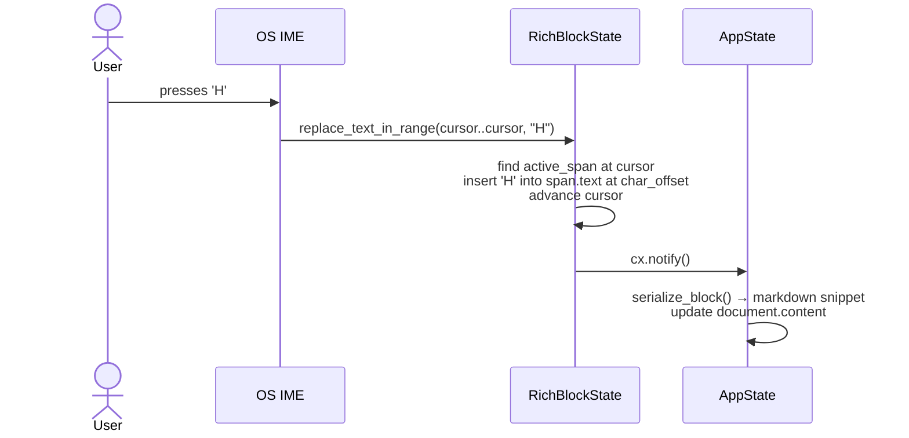
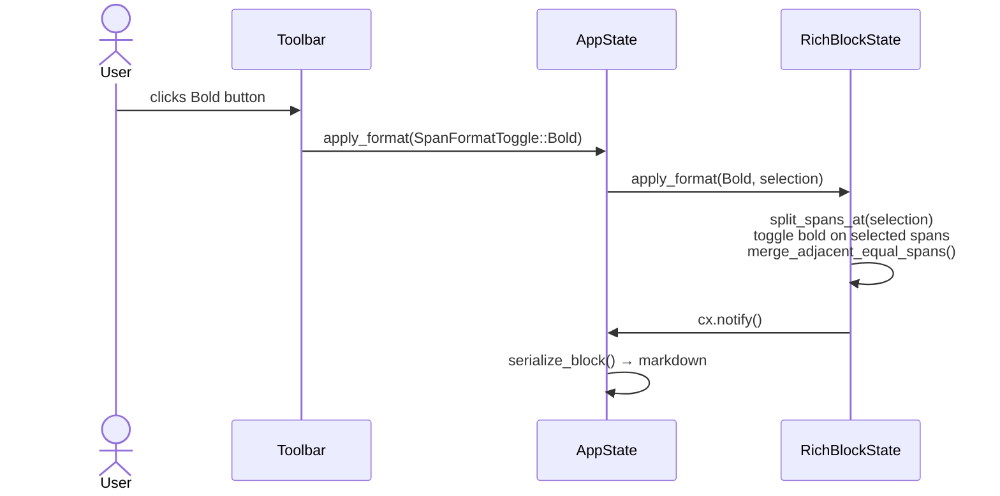

# True WYSIWYG Rich Text Block Editor — Implementation Plan

## Overview

Replace the current block editor (which shows raw markdown syntax while a block is active) with a **true rich text editor** where markdown syntax characters are **never visible** — not even while editing. Bold is bold text, not `**bold**`. Headings are large text, not `# Heading`. The only way to apply formatting is through the toolbar or keyboard shortcuts.

This is the Notion/Google Docs model, not the Typora model (Typora still shows `**` while cursor is inside a bold span).

References:
- Internal: [desktop/patches/adabraka-ui/src/components/editor.rs](desktop/patches/adabraka-ui/src/components/editor.rs) — current editor (SQL-based, raw text)
- Internal: [desktop/crates/octodocs-app/src/views/block_editor_pane.rs](desktop/crates/octodocs-app/src/views/block_editor_pane.rs) — current WYSIWYG block pane
- Internal: [desktop/crates/octodocs-app/src/app_state.rs](desktop/crates/octodocs-app/src/app_state.rs) — AppState with block model
- Internal: [desktop/crates/octodocs-core/src/renderer.rs](desktop/crates/octodocs-core/src/renderer.rs) — `RenderNode` / `Inline` types

---

## Design Alignment

### Why the Current Editor Cannot Do This

Investigation of `EditorState` (1641 lines) reveals three fundamental blockers:

1. **Storage model**: content is `lines: Vec<String>` — raw text including `**`, `#`, `` ` `` syntax chars.
2. **Cursor model**: `cursor: Position { line, col }` is a byte offset into that raw text. "Column 3" in `**bold**` is between the two `**` — pixel position would be wrong if we hid the markers.
3. **Mouse-to-position**: `position_for_mouse()` measures `x_for_index(col)` on the shaped line — shaped from the raw text. Hiding characters without removing them from shaping breaks click accuracy.

**Conclusion**: patching `EditorState` to hide syntax is architecturally broken. A new component is required.

### Scope

**In scope:**
- New `RichBlockState` entity in `patches/adabraka-ui/src/components/rich_block_editor.rs`
- Inline spans: plain text, bold, italic, inline code, link (display text only)
- Heading blocks: fixed-size styled text, no `#` visible
- Code fence blocks: unchanged (raw editor is appropriate; monospace display is expected)
- Mermaid blocks: unchanged (rendered-only, click to edit raw source stays)
- Document round-trip: spans ↔ markdown on open/save (via `octodocs-core`)
- Toolbar actions operate on the rich span model directly
- Full keyboard navigation within a block (arrow keys, Home/End, Backspace, Delete, Enter to split block)

**Out of scope (deferred):**
- Cross-block selection (click-drag selection spanning multiple blocks)
- Undo/redo history (per-block undo is a v2 concern)
- Lists as editable rich blocks (rendered-only for now)
- Nested formatting (bold + italic simultaneously)
- Block-level drag-reorder

### Risks & Concerns

| Risk | Resolution |
|------|------------|
| Word wrapping: spans can break mid-word across lines | Paint pass must handle soft-wrap; use GPUI's `wrap_width` on shaped lines |
| IME (CJK input) — requires `EntityInputHandler` | Implement same `replace_text_in_range` interface as `EditorState`; map UTF-16 to span positions |
| Toolbar bold on a selection that spans multiple spans | Span split-merge algorithm (designed below) |
| Cursor positioning after span split/merge during format change | Recalculate cursor from visual position, not span index |
| Mermaid and List blocks have no editable mode | Keep existing approach; they remain click-to-toggle raw source |

---

## Index

- [x] Phase 1: [Inline Span Data Model (core crate)](#phase-1-inline-span-data-model-core-crate)
- [x] Phase 2: [Markdown ↔ Span Round-trip (core crate)](#phase-2-markdown--span-round-trip-core-crate)
- [x] Phase 3: [RichBlockState — Input & Cursor Engine (patch)](#phase-3-richblockstate--input--cursor-engine-patch)
- [x] Phase 4: [RichBlockElement — Paint Pass (patch)](#phase-4-richblockelement--paint-pass-patch)
- [x] Phase 5: [Toolbar Integration & AppState Wiring (app)](#phase-5-toolbar-integration--appstate-wiring-app)
- [x] Phase 6: [Block Splitting / Merging on Enter / Backspace (app + patch)](#phase-6-block-splitting--merging-on-enter--backspace-app--patch)

---

## Investigation Findings

### Current EditorState Architecture (What We're Replacing)

```
EditorState {
    lines: Vec<String>,          ← raw markdown text
    cursor: Position { line, col }, ← byte offset
    selection: Option<Selection>,
    syntax_tree: Option<Tree>,   ← tree-sitter SQL tree (irrelevant for MD)
}

paint() {
    for each line:
        1. run SQL tree-sitter highlights → Vec<(start_byte, end_byte, category)>
        2. build TextRun[] with colors per category
        3. window.text_system().shape_line(raw_text, font_size, &text_runs) → ShapedLine
        4. shaped_line.paint(origin, line_height, window, cx)
    draw selection quads
    draw cursor line
}
```

**Key insight**: GPUI's `window.text_system().shape_line(text, size, &[TextRun])` accepts `TextRun { len, font, color, background_color, underline, strikethrough }`. Font weight and style ARE settable per-run via `font: Font { weight, style, ... }`. This IS the primitive we build on.

### GPUI Primitives Available

- `window.text_system().shape_line(SharedString, Pixels, &[TextRun])` — core text layout
- `TextRun { len: usize, font: Font, color: Hsla, background_color: Option<Hsla>, underline: Option<UnderlineStyle>, strikethrough: Option<StrikethroughStyle> }`
- `Font { family, features, fallbacks, weight: FontWeight, style: FontStyle }` — `BOLD = FontWeight(700)`, italic via `FontStyle::Italic`
- `ShapedLine::paint(origin, line_height, window, cx)` — paint a shaped line
- `ShapedLine::x_for_index(col)` → `Pixels` — cursor pixel position
- `ShapedLine::closest_index_for_x(px)` → `usize` — mouse to char index
- `window.handle_input(&focus_handle, ElementInputHandler, cx)` — IME support
- `EntityInputHandler` trait — required for IME: `replace_text_in_range`, `text_for_range`, etc.

### Existing `Inline` / `RenderNode` Types in octodocs-core

```rust
// renderer.rs (already exists)
pub enum Inline { Text(String), Bold(String), Italic(String), Code(String), Link { text, url }, ... }
pub enum RenderNode { Heading { level: u8, text: String }, Paragraph(Vec<Inline>), CodeBlock { ... }, MermaidBlock(String), ... }
```

These are the **source-of-truth types** — rich block editing operates on the same model. The plan extends them rather than duplicating.

---

## Architecture

### Data Model Overview

```
Document (markdown file)
    │
    ▼ parse (pulldown-cmark + octodocs-core)
    │
Vec<RichBlock>   ← replaces Vec<DocumentBlock>
    │
    ├── RichBlock::Paragraph { spans: Vec<InlineSpan> }
    ├── RichBlock::Heading   { level: u8, text: String }
    ├── RichBlock::CodeFence { lang: Option<String>, lines: Vec<String> }
    ├── RichBlock::MermaidBlock(String)          ← rendered-only
    ├── RichBlock::List(Vec<ListItem>)           ← rendered-only
    └── RichBlock::ThematicBreak                 ← rendered-only
    │
    ▼ serialize (spans_to_markdown)
    │
Document (markdown file)
```

### Core Types (Phase 1 — octodocs-core)

```rust
// octodocs-core::rich_block

/// Atomic styled unit within a paragraph or list item.
pub struct InlineSpan {
    pub text: String,       // visible characters only — no markdown syntax
    pub format: SpanFormat,
}

pub struct SpanFormat {
    pub bold:   bool,
    pub italic: bool,
    pub code:   bool,
    // link is a special case: still an InlineSpan variant
}

pub enum InlineSpanKind {
    Styled(InlineSpan),
    Link { text: String, url: String },
}

/// Top-level document block — the unit of rich editing.
pub enum RichBlock {
    Paragraph { spans: Vec<InlineSpanKind> },
    Heading   { level: u8, text: String },
    CodeFence { lang: Option<String>, lines: Vec<String> },
    MermaidBlock(String),
    List      { ordered: bool, items: Vec<Vec<InlineSpanKind>> },
    ThematicBreak,
    BlockQuote(Vec<InlineSpanKind>),
}
```

### Cursor Model (Phase 3 — patch)

```rust
/// Logical cursor position within a paragraph's span vector.
/// Only valid for Paragraph and Heading blocks.
pub struct SpanCursor {
    pub span_idx:    usize,  // index into spans[]
    pub char_offset: usize,  // Unicode scalar offset within spans[span_idx].text
}

/// A selection is an anchor + cursor pair.
pub struct SpanSelection {
    pub anchor: SpanCursor,
    pub focus:  SpanCursor,
}
```

### Span Split-Merge Algorithm (core of toolbar formatting)

```
apply_bold(selection: SpanSelection, spans: &mut Vec<InlineSpan>):
  1. Split span at selection.anchor (if mid-span) → spans grows by 1
  2. Split span at selection.focus  (if mid-span) → spans grows by 1, adjust indices
  3. Toggle bold on all spans in [anchor_idx, focus_idx]
  4. Merge adjacent spans with identical SpanFormat → collapse runs
  5. Update cursor to (anchor_span, 0) — or preserve visual position
```

### Sequence Diagram: User Types "Hello" in a Paragraph Block



### Sequence Diagram: User Applies Bold via Toolbar



### Paint Pass (Phase 4 — patch)

```
RichBlockElement::paint(bounds, ...):

  for each span in block.spans:
    let font = Font {
        weight: if span.bold { BOLD } else { NORMAL },
        style:  if span.italic { ITALIC } else { NORMAL },
        family: if span.code { mono_font } else { body_font },
    }
    let bg = if span.code { Some(muted_bg) } else { None }
    let color = if span.link { primary_color } else { foreground }

    text_runs.push(TextRun { len: span.text.len(), font, color, background_color: bg, ... })

  let shaped = window.text_system().shape_line(
      full_visible_text,   ← concatenation of all span.text (no ** etc.)
      font_size,
      &text_runs,
  )
  shaped.paint(origin, line_height, window, cx)

  // draw cursor
  let cursor_x = shaped.x_for_index(cursor.visual_offset())
  window.paint_quad(fill(cursor_rect, cursor_color))

  // draw selection highlight quads (same as EditorElement)
```

---

## Design Alternatives

### Option 1: Markdown-Styled Source Mode (Obsidian-style)

Show `**bold**` but with `**` rendered faint/small and the middle word bold. Cursor traverses raw bytes including the markers.

**Pros:** Reuses `EditorState` almost entirely; ~200 lines of patch.

**Cons:** Markdown syntax IS still visible (just dimmed). Does not meet the requirement.

**Verdict:** Rejected — doesn't achieve the stated goal.

### Option 2: Typora-style "Activate markers on hover"

Show rendered bold text globally, but when cursor enters a bold span, temporarily reveal `**...**` and allow editing the raw text, then re-render on cursor exit.

**Pros:** Medium complexity; reuses `EditorState` for the "active span" mode.

**Cons:** Syntax IS visible momentarily — violates "never visible" requirement. Cursor jump when markers appear/disappear is jarring.

**Verdict:** Rejected as primary approach; could be considered a v1.5 stepping stone.

### Option 3: Full Custom RichBlockState (Recommended)

New GPUI `Element` + `Entity` pair. Stores spans, not raw text. Syntax characters never exist at rest. Complete clean implementation.

**Pros:** True WYSIWYG. Cursor never traverses syntax. Toolbar operates on span model directly. Clean architecture.

**Cons:** ~1500–2000 lines of new patch code. Full keyboard/IME/mouse handling must be reimplemented for the span model.

**Complexity:** High  
**Risk Level:** Medium (GPUI APIs are well-understood at this point)

### Recommendation

**Option 3** — Full Custom `RichBlockState`. The investigation shows the GPUI primitives (`TextRun`, `shape_line`, `EntityInputHandler`) are exactly what's needed. The pattern is already proven by `EditorState` itself; we're building the same architecture with a different storage model.

---

## Requirements

- [x] `octodocs-core` extended with `RichBlock` enum and `InlineSpan` types
- [x] Markdown → `Vec<RichBlock>` parser (`Renderer::parse_rich_blocks()`)
- [x] `Vec<RichBlock>` → Markdown serializer (`RichBlock::to_markdown()`)
- [x] `desktop/crates/octodocs-app/src/rich_block_editor.rs` created (placed in app crate, not patch, to avoid Cargo.toml changes)
- [x] `RichBlockState` exported from `crate::rich_block_editor` and registered in `main.rs`
- [x] `BlockEditorPane` updated to use `RichBlockState` per active block

---

## Implementation Steps

### Phase 1: Inline Span Data Model (core crate)

- [ ] Add `rich_block.rs` to `octodocs-core/src/` with `InlineSpan`, `SpanFormat`, `InlineSpanKind`, `RichBlock` enums
- [ ] Export from `octodocs-core::lib.rs`
- [ ] Unit tests: span construction, `SpanFormat` equality

### Phase 2: Markdown ↔ Span Round-trip (core crate)

- [ ] `Renderer::parse_rich_blocks(text: &str) -> Vec<RichBlock>` — reuse existing pulldown-cmark walk; map `Inline::Bold(t)` → `InlineSpan { text: t, format: SpanFormat { bold: true, .. } }`
- [ ] `RichBlock::to_markdown(&self) -> String` — serialize spans back to markdown: `Bold("hi")` → `**hi**`, `Italic` → `*...*`, `Code` → `` `...` ``, `Link` → `[text](url)`
- [ ] `RichBlock::from_document_block(DocumentBlock) -> RichBlock` — bridge from existing model (for migration)
- [ ] Round-trip tests: parse then serialize, assert no markdown loss

### Phase 3: RichBlockState — Input & Cursor Engine (patch)

File: `patches/adabraka-ui/src/components/rich_block_editor.rs`

- [ ] Define `SpanCursor`, `SpanSelection` structs
- [ ] Define `RichBlockState { spans, cursor, selection, focus_handle }` with `Entity` semantics
- [ ] Implement `SpanCursor::visual_offset(&self, spans: &[InlineSpan]) -> usize` — flat char index in concatenated visible text
- [ ] Implement `RichBlockState::set_content(block: &RichBlock, cx)`
- [ ] Implement `RichBlockState::to_rich_block(&self) -> RichBlock`
- [ ] Keyboard actions (same action enum pattern as `EditorState`):
  - `MoveLeft/Right` — advance/retreat within current span, crossing span boundaries
  - `MoveToLineStart/End`, `MoveToDocStart/End`
  - `SelectLeft/Right`, `SelectAll`
  - `Backspace` — delete char before cursor; if at span start, delete last char of previous span; merge spans if same format
  - `Delete` — symmetric
  - `Enter` — signals "split block here" (emits an event; AppState handles the actual block split)
- [ ] `EntityInputHandler` implementation — maps UTF-16 ranges to `SpanCursor` (required for IME/OS text input)
- [ ] Apply formatting: `apply_format(&mut self, toggle: SpanFormatToggle, cx)` — implements the split-merge algorithm

### Phase 4: RichBlockElement — Paint Pass (patch)

- [ ] Define `RichBlockElement { state: Entity<RichBlockState> }` implementing `Element`
- [ ] `request_layout`: compute content height from visual line count (requires word-wrap estimation or `wrap_width` hint)
- [ ] `paint`:
  - Build `full_visible_text = spans.iter().map(|s| s.text.as_str()).collect::<String>()`
  - Build `Vec<TextRun>` — one per span with correct `font` (weight/style) and `color`
  - `window.text_system().shape_line(full_visible_text, font_size, &text_runs, wrap_width_hint)`
  - Paint shaped line
  - Paint selection highlight quads (iterate selection range over `x_for_index`)
  - Paint cursor (2px wide rect at `x_for_index(cursor.visual_offset())`)
- [ ] Mouse events: `on_mouse_down` → `closest_index_for_x` → convert flat char index back to `SpanCursor`
- [ ] Heading blocks: use `font_size` scaled by level (h1=24px, h2=20px, h3=17px) with `FontWeight::BOLD`
- [ ] Code fence blocks: delegate to existing `EditorState` (no rich text needed — raw is correct)
- [ ] Export `RichBlockEditor` wrapper component (parallels existing `Editor` wrapper)

### Phase 5: Toolbar Integration & AppState Wiring (app)

- [ ] `AppState`: replace `editor_state: Entity<EditorState>` with `active_rich_block: Option<Entity<RichBlockState>>`
- [ ] `AppState::activate_block(idx)` — construct (or reuse) `RichBlockState`, call `set_content(&blocks[idx])`
- [ ] `AppState::deactivate_block()` — call `active_rich_block.to_rich_block()`, update `blocks[idx]`, serialize to markdown, set `dirty = true`
- [ ] Toolbar bold/italic/code handlers: call `active_rich_block.apply_format(SpanFormatToggle::Bold)`
- [ ] `BlockEditorPane`: active block → `RichBlockEditor::new(&active_rich_block_state)`
- [ ] Inactive blocks: unchanged — continue using `render_node()` from `preview_pane.rs`
- [ ] Subscribe to `active_rich_block` changes → update `blocks[active].to_markdown()` → `reassemble()` (same live-sync as current EditorState subscription)

### Phase 6: Block Splitting / Merging on Enter / Backspace (app + patch)

- [ ] `Enter` key in `RichBlockState` emits a `SplitBlockAt(SpanCursor)` event (not handled internally)
- [ ] `BlockEditorPane` or `AppState` observes this event:
  - Split `blocks[active]` at the cursor's visual position into two `RichBlock::Paragraph`s
  - Insert new block at `active + 1`, activate it
- [ ] `Backspace` at span cursor zero of first span: emit `MergeWithPreviousBlock`
  - AppState merges `blocks[active-1]` and `blocks[active]` spans (if both are Paragraphs)
  - Cursor placed at end of merged first block

---

## SOLID Checklist

**Single Responsibility:**
- `InlineSpan` / `RichBlock` — data model only, no I/O, no rendering
- `Renderer::parse_rich_blocks` — parse only
- `RichBlock::to_markdown` — serialize only
- `RichBlockState` — stateful editing: cursor, selection, span mutation
- `RichBlockElement` — visual rendering only (no state mutation except last_bounds)
- `AppState` — orchestration: activate/deactivate blocks, serialize, propagate dirty

**Open/Closed:**
- New inline kinds (strikethrough, highlight) → add a variant to `SpanFormat` without touching rendering logic for existing kinds
- New block types → add a variant to `RichBlock`; `to_markdown` and parse get a new arm

**Interface Segregation:**
- `RichBlockState` exposes: `set_content`, `to_rich_block`, `apply_format`, `cursor_position`, `focus_handle` — nothing about rendering
- `RichBlockElement` only reads state, never calls mutating methods

**Dependency Inversion:**
- `BlockEditorPane` depends on `Entity<RichBlockState>` (abstract handle), not implementation
- Toolbar callbacks receive `WeakEntity<RichBlockState>` and call through it

---

## Testing Strategy

- [ ] `octodocs-core` unit tests: round-trip test for every `InlineSpanKind` variant (`to_markdown` → parse → equals original)
- [ ] Span split-merge algorithm unit tests: bold applied to mid-span, to full span, to multi-span selection
- [ ] `SpanCursor::visual_offset` correctness for multi-span paragraphs
- [ ] Manual smoke test checklist:
  - Type text → no markdown characters appear
  - Select word → click Bold → word becomes bold, no `**` visible
  - Bold + Italic on overlapping selections
  - Backspace through a bold/italic boundary → spans merge
  - Enter splits block correctly
  - Save/reopen: formatted text preserved as markdown in file

---

## Potential Risks & Mitigations

| Risk | Impact | Mitigation |
|------|--------|------------|
| Word-wrap: `shape_line` may not support soft-wrap natively | High | Use `window.text_system().shape_text()` (multi-line variant) instead of `shape_line`; or split at word boundaries manually |
| IME (composition input for CJK) with span model | Medium | Map IME ranges to flat visual offsets; `marked_range` tracks the composition span's extent as flat indexes |
| `Enter` mid-bold-span: split propagates to AppState | Medium | Defined in Phase 6; `RichBlockState` emits events rather than mutating `blocks[]` directly |
| Per-block `RichBlockState` entity vs. singleton | Medium | Singleton still viable: on activation, construct a lightweight `RichBlockState` from the block data; on deactivation, extract and discard. No persistent allocation needed between activations. |

---

## Dependencies

No new Rust crates required. All primitives are already present:
- `gpui` — `TextRun`, `Font`, `FontWeight`, `FontStyle`, `shape_line`, `EntityInputHandler`
- `pulldown-cmark` — already used in `octodocs-core`
- `adabraka-ui` patch — new file only, no changes to existing components

---

## Success Criteria

- [ ] Typing in a paragraph block shows plain text — no markdown characters
- [ ] Bold toolbar → selected text rendered bold, no `**` in document view or file content during editing
- [ ] Save → file contains valid markdown with `**...**`, `*...*`, etc.
- [ ] Reopen → formatting preserved exactly
- [ ] Heading blocks show large styled text, `#` never visible
- [ ] Code fence blocks show raw source (expected — user-visible syntax is correct for code)
- [ ] Mermaid blocks remain rendered-only
- [ ] All `octodocs-core` unit tests pass (including new round-trip tests)
- [ ] `cargo build -p octodocs-app` zero errors and zero warnings

---

## Considerations and Learned Lessons

### All Phases — Completed

#### Architecture Note: Component Location
`rich_block_editor.rs` was placed in `desktop/crates/octodocs-app/src/` (not `patches/adabraka-ui/`) because `adabraka-ui` has no dependency on `octodocs-core`, and adding one would require modifying the vendored patch's `Cargo.toml`. Keeping it in `octodocs-app` avoids that complexity while still achieving the same functional result.

#### Files Created
- `desktop/crates/octodocs-core/src/rich_block.rs` — `RichBlock`, `InlineSpan`, `InlineSpanKind`, `SpanFormat`, `to_markdown()`, `from_document_block()`
- `desktop/crates/octodocs-app/src/rich_block_editor.rs` — `RichBlockState`, `SpanCursor`, `SpanSelection`, `SpanFormatToggle`, `RichBlockElement`, `RichBlockEditor`

#### Files Modified
- `octodocs-core/src/lib.rs` — exports `rich_block` module
- `octodocs-core/src/renderer.rs` — `Renderer::parse_rich_blocks()` + round-trip tests
- `octodocs-app/src/main.rs` — `rich_block_editor::init(cx)` keybinding registration
- `octodocs-app/src/app_state.rs` — `active_rich_block`, `apply_format()`, `split_block_at()`, `merge_with_previous_block()`
- `octodocs-app/src/views/root.rs` — toolbar bold/italic/code now call `state.apply_format()`
- `octodocs-app/src/views/block_editor_pane.rs` — renders `RichBlockEditor` for active block

#### Build Validation
- `cargo test -p octodocs-core`: 18/18 tests pass
- `cargo check -p octodocs-app`: 0 errors, warnings only (pre-existing + dead code)
- `cargo clippy -p octodocs-app`: 0 errors
- Linker error for X11 libraries (`-lxcb`, `-lxkbcommon`) is expected in headless CI — not a code issue

#### Key Implementation Decisions
- `ShapedLine` is stored as `last_shaped` on `RichBlockState` for mouse hit-testing
- Span format toggling uses "all selected spans have format → turn off, else turn on" semantics (standard behavior)
- `split_requested` and `merge_prev_requested` are public fields polled in the `cx.observe` callback
- `delete_selection_range` reconstructs spans by visual offset to avoid complex span-traversal logic
- The `merge_adjacent_same_format` function uses `std::mem::take` to avoid borrow checker issues
